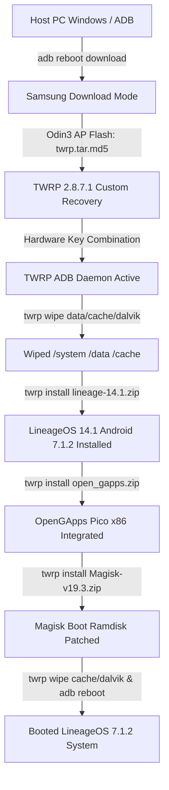

# Technical Flashing Guide: Samsung Galaxy Tab 3 10.1 (GT-P5200 / GT-P5210)

This document details the exact execution workflow, terminal parameters, and recovery commands required to flash **LineageOS 14.1 (Android 7.1.2 x86)** with **OpenGApps** and **Magisk v19.3** on the Samsung Galaxy Tab 3 10.1.

---

## Technical Workflow Architecture



---

## Section 1: Pre-Flashing Environment Check

Run the following command in PowerShell on the host PC to verify USB connectivity and driver binding:

```powershell
Get-PnpDevice -PresentOnly | Where-Object { $_.FriendlyName -like '*Samsung*' -or $_.Class -eq 'AndroidDevice' } | Select-Object Status, Class, FriendlyName
```

### Expected Output:
```text
Status Class             FriendlyName
------ -----             ------------
OK     Modem             SAMSUNG Mobile USB Modem
OK     AndroidUsbDevice  SAMSUNG Android ADB Interface
OK     USB               SAMSUNG Mobile USB Composite Device
```

---

## Section 2: Bootloader Download Mode & Odin Configuration

1. Connect the tablet to the PC via USB.
2. Open PowerShell and send the ADB reboot command:
   ```powershell
   & "$ENV:LOCALAPPDATA\Android\Sdk\platform-tools\adb.exe" reboot download
   ```
3. Launch `Odin3 v3.13.1.exe`.
4. Configure Odin parameters:
   - **AP Slot**: Select `twrp-2.8.7.1-p5210.tar.md5`.
   - **Options Tab**: Uncheck `Auto Reboot`.
5. Click **Start**. Verify Odin log reports `succeed 1 / failed 0`.

---

## Section 3: Hardware Key Handshake for TWRP Entry

When Odin completes, the screen remains on `Downloading... Do not turn off target`.

1. Hold `[Power + Volume Down]` for 7–10 seconds.
2. The instant the display powers off, immediately switch to holding `[Power + Home + Volume Up]`.
3. Release all keys once the `TWRP 2.8.7.1` splash logo appears.

---

## Section 4: Automated ADB Recovery Flashing Sequence

Execute the following commands sequentially in host PowerShell:

```powershell
$ADB = "$ENV:LOCALAPPDATA\Android\Sdk\platform-tools\adb.exe"

# 1. Verify ADB Recovery Connection
& $ADB devices
# Expected: <Serial_ID> recovery

# 2. Execute Data, Cache, and Dalvik Wipes
& $ADB shell "twrp wipe data; twrp wipe cache; twrp wipe dalvik"

# 3. Flash LineageOS 14.1 Android 7.1.2 Nougat ROM
& $ADB shell "twrp install /external_sd/GT-P5200/lineage-14.1-20190408-UNOFFICIAL-santos10wifi.zip"

# 4. Flash OpenGApps Pico x86 Package
& $ADB shell "twrp install /external_sd/GT-P5200/open_gapps-x86-7.1-pico-20220503.zip"

# 5. Flash Magisk v19.3 Superuser Payload
& $ADB shell "twrp install /external_sd/GT-P5200/Magisk-v19.3.zip"

# 6. Final Cache Wipe & Reboot to System
& $ADB shell "twrp wipe cache; twrp wipe dalvik"
& $ADB reboot
```

---

## Section 5: Log Verification & Diagnostic Traces

You can inspect full installation logs directly from TWRP runtime using:

```powershell
& $ADB shell "cat /tmp/recovery.log | tail -n 40"
```

### Successful Execution Indicators:
- ROM Installation: `script succeeded: result was [1.000000]`
- OpenGApps: `- Installation complete!`
- Magisk: `- Flashing new boot image - Done`
